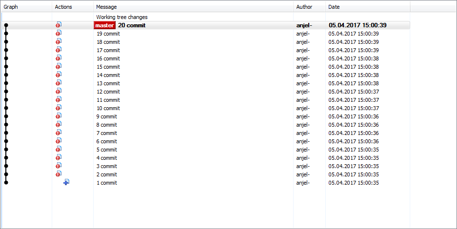
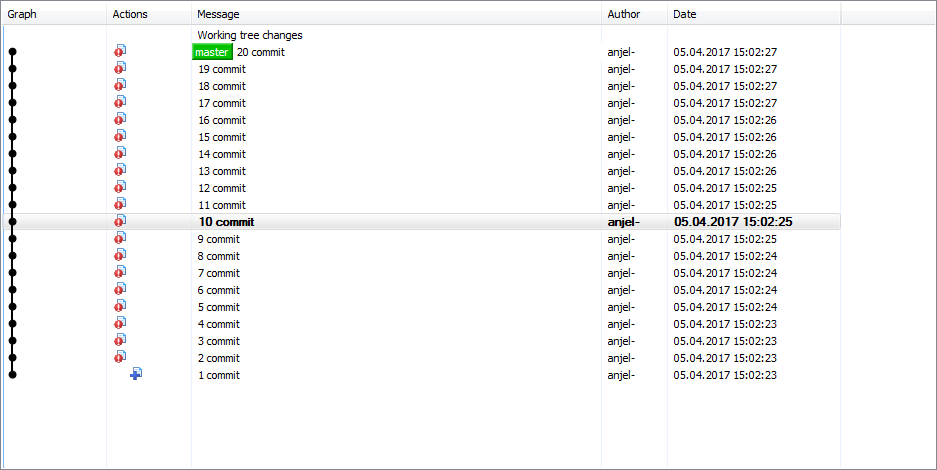
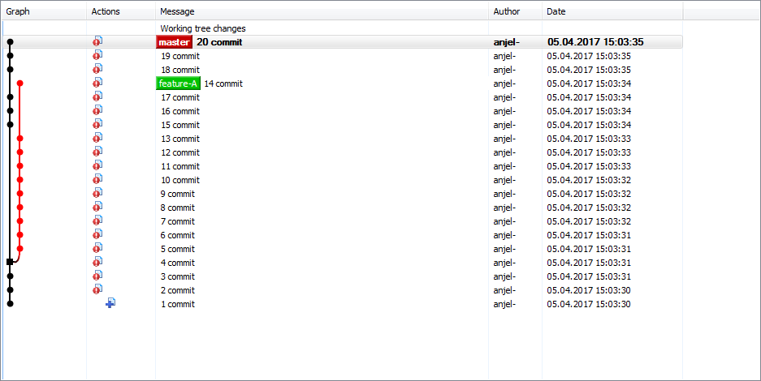
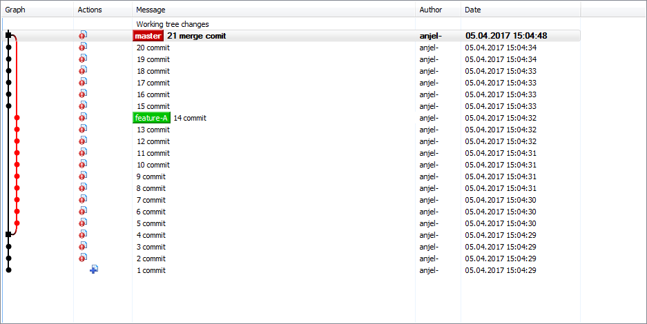

# Project: learn-git-by-exercising
This is a simple script that can help to reproduce the common git use cases like linear commits history, detached HEAD and so on.
The most tutorials like [Git Book](https://git-scm.com/book/en/v2) explain very well these use cases but it could be very helpful to have a sample project with such use case to vizualize it with your favorite git repo browser like [TortoiseGit](https://tortoisegit.org/) or [gitk](https://www.kernel.org/pub/software/scm/git/docs/gitk.html) 

## Typical git use cases
### Use Case: linear commits history

### Use Case: detached HEAD

### Use Case: diverged branch

### Use Case: 3 way merge

